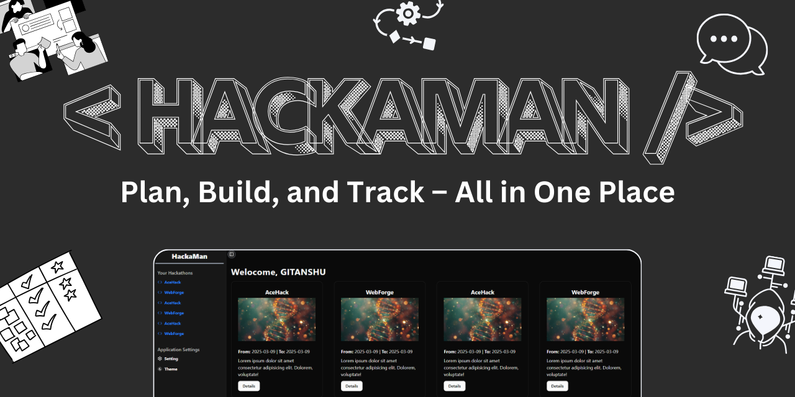

# HackaMan - Your One-Stop Solution for Hackathon Project Management

## 🚧Project Under Developement🚧

Are you tired of managing multiple hackathon teams through WhatsApp groups or Discord? **HackaMan** is here to simplify your experience!

**HackaMan** is a web-based application designed to help users efficiently manage their hackathon projects and teams. With features like:

- **Multi-Project Management**
- **Team Collaboration & Planning**
- **Kanban Board for Task Tracking**
- **AI Assistant for Project Guidance & Debugging**

It ensures that you stay on top of your project deadlines and team progress during hackathons!

---

## Installation Guide

### Prerequisites

- **MongoDB Database Access**
- **Verified SendGrid Sender Email and API Key** 📩

### - Backend Setup

```bash
cd backend
npm install
cp .env.template .env  # Rename and configure your .env file
npm start
```

### - Frontend Setup

```bash
cd frontend
npm install
```

Now, update `vite.config.js` to match your backend port:

```javascript
proxy: {
    "/auth": "http://localhost:<BACKEND_PORT>",
    "/util": "http://localhost:<BACKEND_PORT>",
},
```

Then, start the frontend server:

```bash
npm run dev
```

---

## Project Structure

```
HackaMan/
│── backend/
│   ├── controllers/        # Request handling logic
│   ├── db/                # Database connection setup
│   ├── middlewares/       # Middleware functions
│   ├── models/            # Database models
│   ├── routes/            # API routes
│   ├── templates/         # Email & API templates
│   ├── .env               # Environment variables
│   ├── app.js             # Backend entry point
│   ├── package.json       # Backend dependencies
│
│── frontend/
│   ├── public/            # Static assets
│   ├── src/
│   │   ├── components/    # UI Components
│   │   ├── context/       # Global state management
│   │   ├── hooks/         # Reusable custom hooks
│   │   ├── layouts/       # Page layouts
│   │   ├── lib/           # Utility functions
│   │   ├── pages/         # Application pages
│   │   ├── index.css      # Global styles
│   │   ├── main.jsx       # Frontend entry point
|   ├── index.html         # Main index html file serve to client
│   ├── vite.config.js     # Vite server config
│   ├── package.json       # Frontend dependencies
```

---

## 🚀 Tech Stack

### 🔹 Backend

- **Express.js** - Fast and lightweight Node.js framework
- **MongoDB + Mongoose** - Database and ODM
- **JWT Authentication and Bcrypt** - Secure user authentication with proper encryption and decryption
- **Nodemailer** - Email services using SendGrid Transporter

### 🔹 Frontend

- **React.js** - Component-based Javascript UI library
- **ShadCN UI + TailwindCSS** - Modern UI styling
- **React Hook Form** - Form management
- **Zod** - Schema validation for forms and APIs
- **Axios** - API communication

---

## Contact

For any issues or collaboration, feel free to reach out **Gitanshu sankhla**:

[](https://github.com/Gitax18) [](https://linkedin.com/in/gitanshu-sankhla)
[](https://www.instagram.com/gitanshusankhla)
